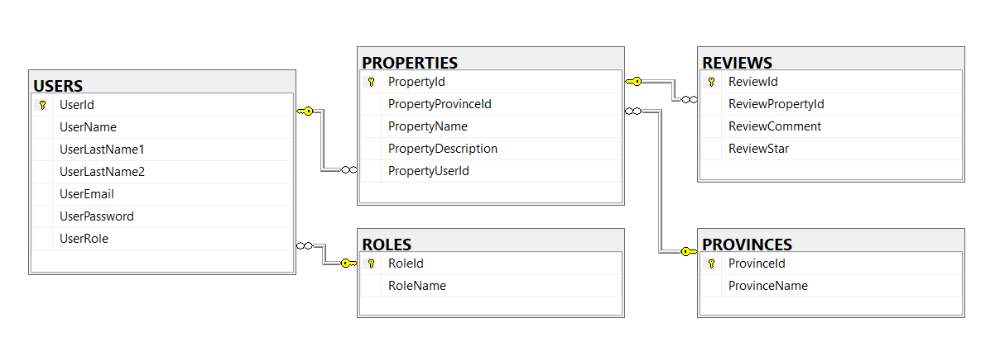

# RankSaty - Apartments 🏠


`RankStay` is an app that seeks to be the reliable source of information for university students in search of the most suitable place to live according to their criteria.

In `RankStay` users can rate from 1 to 5 their general experiencie in an apartment and comment, this valuable information aids individuals seeking the optimal accommodation during their college years, helping them make informed decisions.

> Happy staying!

**Technologies used**

<a href="https://dotnet.microsoft.com/en-us/learn/csharp" title="C#"></a>
<a href="https://dotnet.microsoft.com/en-us/" title=".NET"></a>
<a href="https://learn.microsoft.com/en-us/sql/ssms/sql-server-management-studio-ssms?view=sql-server-ver16" title="SQL Server Management Studio SSMS"></a>
<a href="https://www.postman.com/" title="Postman"></a>
<a href="https://git-scm.com/" title="Git"></a>
<a href="https://getbootstrap.com/" title="Bootstrap"></a>
<a href="https://www.w3schools.com/html/" title="HTML"></a>
<a href="https://www.w3schools.com/css/" title="CSS"></a>

## Sections

- [Install RankStay locally](#install-rankstay-locally)

## Install RankStay locally

Go to `SQL/RankStay_script.sql` and execute the script in the <a href="https://learn.microsoft.com/en-us/sql/ssms/sql-server-management-studio-ssms?view=sql-server-ver16">SQL Server Management Studio SSMS</a>



Once you have the database locally, go to `RankStay_API/RankStay_API` and make sure your `appsettings.json` file looks like this:

*Note: server={SERVER\\\NAME};*

```js
{
  "ConnectionStrings": {
    "Connection": "server=; database=RankStayData; trusted_connection=True"
  },
  "Logging": {
    "LogLevel": {
      "Default": "Information",
      "Microsoft.AspNetCore": "Warning"
    }
  },
  "AllowedHosts": "*"
}
```